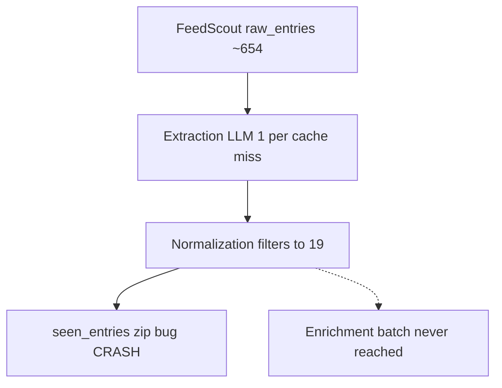
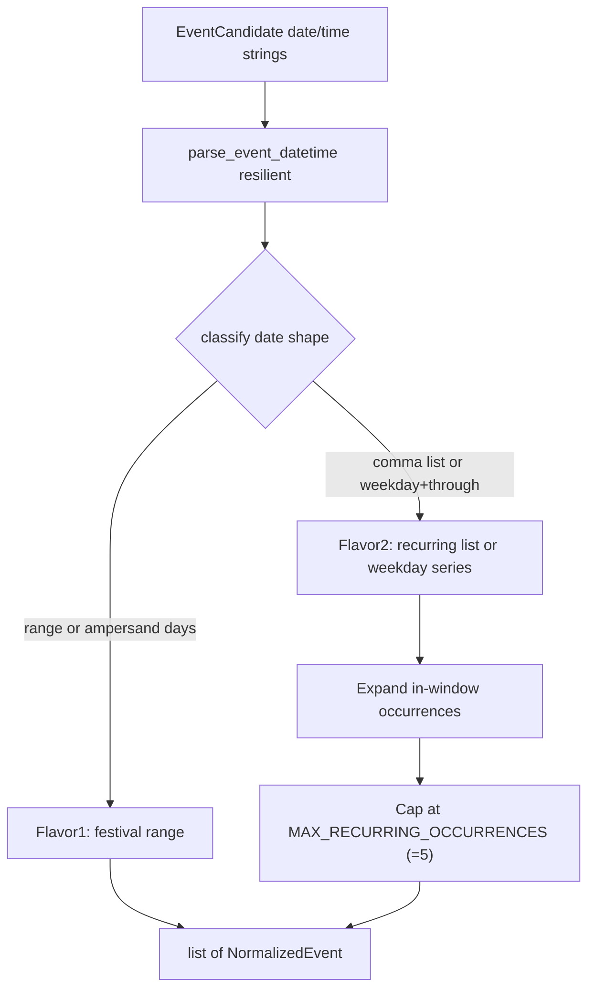
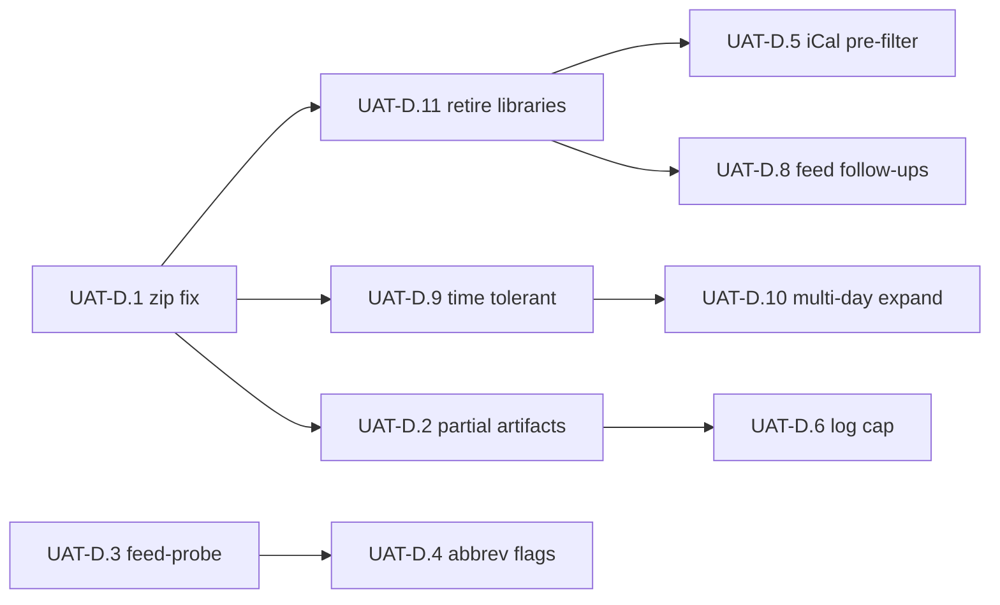

# SceneScout: UAT Debug Plan (2026-06-29)

**Incident run:** `20260629-013422`

This plan documents fixes and enhancements triggered by the first full dry-run UAT after
Phase 1B multi-source ingestion. It complements — but does not replace — the main
[project plan](project_plan.md) and [architecture](architecture.md) UAT documentation.

**Related project plan sections:**
- [Phase 7.7 — Full End-to-End UAT](project_plan.md) (dry-run and live-email gates)
- [Phase 10 — Observability and Dev Section](project_plan.md) (structured logging, feed
  health dashboard, dry-run trigger in web UI)

**Related architecture sections:**
- [UAT Mode](architecture.md) — full pipeline behavior, `--dry-run`, release gate rule

---

## Goal

Restore reliable **dry-run UAT** completion after Phase 1B ingest expansion, and make
day-to-day UAT iteration **affordable in time and LLM cost** without weakening the
pre-release integration gate.

**Branching:** One feature branch per subphase (e.g. `fix/uat-d1-seen-entries-zip`), same
convention as Phase 1B.

---

## Incident Summary

First full `uv run python -m scene_scout.cli uat --prompt "..." --dry-run --verbose` after
enabling iCal and scrape sources. Run lasted ~41 minutes, crashed during post-normalization
cache write, and produced no `output/uat_{run_id}/` artifacts.

| Signal | Value |
|---|---|
| Run ID | `20260629-013422` |
| Structured log | `vol-logs/20260629-013422.jsonl` (~1292 lines) |
| Wall time | ~41 minutes (01:34–02:15 UTC) |
| Outcome | Crashed after normalization; no `summary.json` or `email_preview.html` |
| Error | `ValueError: zip() argument 2 is shorter than argument 1` in `_store_seen_entries_after_normalization` (`scene_scout/orchestrator.py`) |
| Extraction → normalization | 607 candidates → **19** normalized events (JSONL final normalization line) |
| Ingest | 4/5 active feeds OK (~654 raw entries); Oh My Rockness scrape `HTTP 401` |



**Contributing factors (not the crash itself):**
- Event extraction issues **one LLM call per cache-miss raw entry** — dominant cost with
  ~600+ iCal/RSS items from interim LibCal feeds.
- Many iCal VEVENTs are far outside the 7-day normalization window; extraction still paid
  to classify them as events before normalization discarded them.
- Library iCal feeds (`bpl_calendar`, `nypl_events`) drove ~90% of normalization discards
  and ~95% of unparseable-date failures — motivating feed retirement (see Product
  decisions and UAT-D.11).
- `--verbose` printed hundreds of per-candidate normalization discard lines to the terminal.
- Dry-run skips **Resend only**; email HTML generation was never reached.

### Funnel analysis

Structured discard counts from `vol-logs/20260629-013422.jsonl`:

| Stage | Count |
|---|---|
| Raw entries (ingest) | ~654 |
| Extraction candidates | 607 |
| Normalized events | 19 |

653 entries reached extraction LLM; 46 were discarded as `is_event=False`. Normalization
discarded 588 of 607 candidates:

| Normalization discard reason | Count | % of raw |
|---|---:|---:|
| Outside 7-day window | 370 | 56.6% |
| Missing venue | 131 | 20.0% |
| Unparseable date | 87 | 13.3% |
| Extraction: not an event | 46 | 7.0% |

**82 of 87** unparseable-date discards came from `bpl_calendar` LibCal series strings
(e.g. `Tuesdays, July 7 through September 15`), not independent listings. See Product
decisions below for the response strategy.

---

## Product decisions

Follow-up decisions from funnel analysis (2026-06-29). These guide UAT-D.5, UAT-D.9–D.11.

### A. Retire library calendar feeds

- Deactivate `nypl_events` and `bpl_calendar` in `config/feeds.yaml` — they emit
  week/month-long class series, dominate LLM cost, and skew the funnel.
- Retire interim LibCal feeds (UAT-D.11); keep the iCal pre-filter (UAT-D.5) for any
  `source_type: ical` source re-enabled or added later.
- Replace with **independent NYC sources**: local newspapers, creative/community calendars
  (e.g. existing `dance_nyc` scrape target, Eventbrite when token ready, fixed
  `ohmyrockness_nyc`, additional RSS/scrape research).
- Cross-reference: [Phase 1B in project_plan.md](project_plan.md) still mentions library
  calendars; UAT-D retires them pending rediscovery of official NYPL/BPL endpoints.

### B. Bad time ranges must not drop events

- **Rationale:** date alone is actionable; the user can call the venue, Google the event,
  or follow the listing link for hours.
- **Policy:** if `date + time` fails to parse, **fall back to date-only** (noon UTC
  default, existing behavior in `scene_scout/agents/event_normalization.py`).
- Strip common range tokens before retry: en-dash ranges (`9:00 am – 1:00 pm`), `to`
  ranges (`1:00 to 2:00 PM`), hyphen windows (`10-11 AM` → try start token only when
  combined parse fails).
- Implementation: UAT-D.9.

### C. Capture multi-day and recurring listings

Two flavors, handled deterministically at normalization (no extra LLM). Implementation:
UAT-D.10.



| Flavor | Example input | Normalized output |
|---|---|---|
| **Festival** | `June 27-28`, `August 28 & 29`, `June 10 – June 28` | **One** `NormalizedEvent`: `start_datetime` = first day, `end_datetime` = last day (`NormalizedEvent.end_datetime`). Window check: event passes if `[start, end]` **overlaps** `[now, now + 7 days]`. |
| **Recurring** | `July 2, July 9, July 15`, `Tuesdays, July 7 through September 15` | **One `NormalizedEvent` per in-window occurrence**, distinct IDs via per-occurrence date in `compute_normalized_event_id`. **Cap at 5** occurrences via `MAX_RECURRING_OCCURRENCES = 5` in `scene_scout/normalization_config.py` (same pattern as `CURATOR_MAX_*` in `curator_config.py`). |

Preserve original date/time prose in `description` when expanding (no data loss for the
email link path).

Common unparseable patterns from the incident run (series headers, multi-date lists,
ISO date + time range) are documented in UAT-D.9 and UAT-D.10 acceptance criteria.

---

## Subphases

### UAT-D.1 — Fix seen_entries cache after partial normalization

**Priority:** P0 — blocks all full UAT completion.

**Root cause:** `event_normalization.run()` returns only successful `NormalizedEvent`
rows (607 → 19 in the incident run), but `_store_seen_entries_after_normalization`
zips the **full** `candidates` list with `newly_normalized` using `strict=True`. When
any candidate is discarded, list lengths diverge and the pipeline crashes.

**Files:** `scene_scout/orchestrator.py`, `tests/test_orchestrator.py`

**Done when:**
- Full dry-run UAT passes normalization and cache write with mixed discard reasons
- `seen_entries` populated only for successfully normalized `(feed_id, entry_hash)` pairs
- Existing `test_store_seen_entries_after_normalization` still passes
- New regression test: many candidates, subset normalized (mirrors real UAT scale)

---

### UAT-D.2 — Partial UAT artifacts on failure

**Priority:** P1 — observability gap exposed by this run.

**Root cause:** `run_uat()` in `scene_scout/cli.py` writes `summary.json` only after
`Orchestrator().run()` returns successfully. On exception, operators get JSONL in
`vol-logs/` but nothing under `output/uat_{run_id}/`.

**Note:** `vol-logs/{run_id}.jsonl` is written incrementally during the run (gitignored).
Partial output artifacts complement — not replace — that trail.

**Files:** `scene_scout/cli.py`, `scene_scout/orchestrator.py` (optional stage checkpoints)

**Done when:**
- Failed run still creates `output/uat_{run_id}/` with:
  - `summary.json` — partial stage counts and `"status": "failed"`
  - `error.json` — exception type, message, last completed stage
- Optional: `checkpoint.json` after feed scout, extraction, and normalization (counts only)

---

### UAT-D.3 — Feed-probe CLI (ingest-only, no LLM)

**Priority:** P1 — daily Phase 1B verification without 30+ minute cost.

**Files:** `scene_scout/cli.py`, `tests/test_cli.py`

**Done when:**
- New subcommand `feed-probe` (or equivalent) reuses `load_feed_configs()` +
  `feed_scout.run()`
- Completes in seconds; prints per-feed table and writes
  `output/feed_probe_{timestamp}.json`
- Exit code non-zero when any active feed is not `ok` (optional `--allow-failures` to
  override)
- Documented as **Tier A** in the operating guide below

---

### UAT-D.4 — Abbreviated full UAT flags

**Priority:** P1 — cost/time control for dry-run iteration.

**Problem:** Dry-run skips Resend only. Event extraction remains **1 LLM call per
cache-miss raw entry** (`scene_scout/agents/event_extraction.py`) — the dominant cost
when iCal feeds emit hundreds of VEVENTs.

**Files:** `scene_scout/cli.py`, `scene_scout/orchestrator.py`,
`scene_scout/orchestrator_config.py` or `scene_scout/config.py`, `tests/test_cli.py`

**Proposed flags on `uat` subcommand:**
- `--max-extraction N` — cap entries sent to extraction after `seen_entries` partition
- `--feeds id1,id2` — run a subset of active feeds
- `--stop-after {feeds|extract|normalize|enrich|email}` — early exit with partial summary

Optional env: `UAT_MAX_EXTRACTION` for non-flag use.

**Done when:**
- `uat --dry-run --max-extraction 25 --feeds brooklynvegan,theskint` completes in minutes
- `--stop-after` writes stage-appropriate partial summary (and preview when stopping at
  or after email)
- Full unflagged dry-run remains the pre-release integration gate (unchanged semantics)

---

### UAT-D.5 — iCal pre-filter before extraction

**Priority:** P2 — reduces LLM waste from high-volume iCal sources.

**Problem:** iCal adapters (LibCal and other `.ics` subscriptions) can emit hundreds of
VEVENTs, many outside the 7-day normalization window. Without a pre-filter, every
cache-miss entry reaches extraction before normalization discards it.

**Files:** `scene_scout/agents/sources/ical.py`, `tests/agents/test_ical_source.py`

**Design (v1):**
- Drop VEVENTs whose `DTSTART`/`DTEND` do not overlap `[now, now + NORMALIZATION_WINDOW_DAYS]`
- `FeedHealthReport.entries_fetched` reflects post-filter count (what reaches extraction)
- **RRULE expansion** is out of v1 scope — recurring series whose `DTSTART` is outside
  the window are dropped even if a future occurrence would fall in-window

**Done when:**
- iCal adapter drops out-of-window VEVENTs before building `RawFeedEntry` rows
- `feed-probe` entry counts drop for heavy iCal feeds without losing near-term events
- Unit tests cover in-window keep, out-of-window drop, all-day overlap, and empty
  post-filter calendar

**Complements UAT-D.11:** library feeds are retired in config; the filter protects any
future iCal source.

---

### UAT-D.6 — Normalization log noise cap

**Priority:** P2 — `--verbose` UAT usability.

**Problem:** The incident run logged one terminal/JSONL line per discarded candidate
(~600 lines). Correct behavior, but obscures useful signals.

**Files:** `scene_scout/agents/event_normalization.py`

**Done when:**
- Terminal output aggregates discard counts by reason and logs sample titles (e.g. first
  5 per reason + summary line)
- JSONL retains structured discard detail (full or sampled `data` blocks) for debugging

---

### UAT-D.7 — Tiered UAT operating guide

**Priority:** P0 for operators — how to run UAT without paying full cost every time.

#### Tiers

| Tier | Command | LLM | Typical use |
|---|---|---|---|
| **A** | `feed-probe` | No | Ingest health after feed/config/adapter changes |
| **B** | `uat --dry-run --max-extraction N --feeds …` | Limited | Pipeline smoke (extract → normalize) |
| **C** | `uat --dry-run` (full flags) | Full | Pre-release integration; email preview HTML |
| **D** | `uat` (no `--dry-run`) | Full + Resend | Release gate — see [Phase 7.7](project_plan.md) |

Tier **C** still generates `email_preview.html`; it only skips sending via Resend.
Tier **D** requires Resend config and confirms inbox delivery (architecture rule: if the
email did not arrive, the live UAT did not pass).

#### Where to read results

| Artifact | Location | When written |
|---|---|---|
| Per-feed ingest health | Terminal table; `summary.json` → `feed_health` | Successful UAT; partial on failure after UAT-D.2 |
| Stage funnel counts | `output/uat_{run_id}/summary.json` | End of run (or partial on failure) |
| Generated email | `output/uat_{run_id}/email_preview.html` | After email composer (Tier C/D) |
| Structured agent logs | `vol-logs/{run_id}.jsonl` | Continuously during run |
| Mid-pipeline state | `vol-pipeline-state/` | After pre-enrichment filter (batch boundary) |

#### Key count fields in `summary.json`

- `raw_entries` — total `RawFeedEntry` objects from Feed Scout
- `feed_health[].entries_fetched` — per-source ingest count
- `extraction_candidates` — entries the LLM classified as events
- `normalized_events` — survivors after normalization (+ cache hits)
- `after_pre_enrichment_filter` — events in the coming week passing quality gates
- `curated_recommendations` / `top_recommendations` — final email input

#### Cache and repeat runs

A second full UAT on the same raw entries benefits from `seen_entries` cache hits:
extraction LLM is skipped for entries already normalized in a prior run. Clear or rotate
`vol-cache/` when testing cold-start extraction behavior.

#### Example commands

```bash
# Tier A — ingest only (~seconds)
uv run python -m scene_scout.cli feed-probe

# Tier B — limited pipeline smoke
uv run python -m scene_scout.cli uat \
  --prompt "Live music and free NYC shows this week" \
  --dry-run --max-extraction 25 --feeds brooklynvegan,theskint

# Tier C — full integration, no email send
uv run python -m scene_scout.cli uat \
  --prompt "Live music, free NYC shows, and creative community events this week" \
  --dry-run

# Tier D — release gate (requires RESEND_* and USER_EMAIL)
uv run python -m scene_scout.cli uat \
  --prompt "Live music, free NYC shows, and creative community events this week"
```

---

### UAT-D.8 — Feed follow-ups (config / scrape)

**Priority:** P3 — data quality; separate from pipeline bugs. Track as small PRs after
UAT-D.1 lands. Feed retirement details in UAT-D.11.

**Status:** Implemented in `config/feeds.yaml` (Jun 2026). Removed broken NY feeds
(LibCal libraries, OMR, Dance/NYC, BPL). Added creative-community sources; two scrape
feeds active after live verification.

| Feed | Issue | Decision |
|---|---|---|
| `brooklynvegan`, `theskint` | Many extraction LLM calls return `is_event=False` (editorial RSS) | **Keep active** — core independent listings |
| `brooklyn_rail`, `harlem_one_stop` | CSS scrape verified Jun 2026 | **Active** — creative community |
| Pending sources (BAC, Artforum, Nonsense NYC, West Harlem Arts, Eventbrite) | No working ingest yet | **Not in config** — research table only |
| LibCal / OMR / BPL / Dance/NYC (removed) | Class-series skew, 401 API, dead feeds | **Deleted from config** |

**Tier B/C default feed set:** `brooklynvegan,theskint` (+ `brooklyn_rail,harlem_one_stop` when running full creative-community ingest).

**Done when:** Decisions recorded; config/adapter changes merged independently of UAT-D.1–D.4.

#### UAT-D.8 source research (Jun 2026)

SceneScout targets **distinct events** (shows, openings, readings), not long-duration
class series or semester workshops.

| Source | Config id | Status | Notes |
|---|---|---|---|
| Brooklyn Rail | `brooklyn_rail` | **In config** | 32 events via CSS scrape |
| Harlem One Stop | `harlem_one_stop` | **In config** | Homepage event tiles |
| Brooklyn Arts Council | — | Not in config | Squarespace client-side render |
| Artforum Artguide | — | Not in config | PMC client-rendered calendar |
| Nonsense NYC | — | Not in config | Newsletter/site; no event feed |
| West Harlem Arts Alliance | — | Not in config | `/feed/` returns HTML not RSS |
| Eventbrite NYC | — | Not in config | Requires API token + adapter |
| Artscards | — | Skip | Domain for sale |
| Gothamist / Hyperallergic / Village Voice | — | Not added | Editorial RSS, not event calendars |
| Time Out NYC | — | Not added | things-to-do `/feed` 404 |

**Minimum before next Tier C UAT:** evaluate ≥2 new independent sources via `feed-probe`
(see UAT-D.11). `brooklyn_rail` and `harlem_one_stop` satisfy this when active.

---

### UAT-D.9 — Time-range tolerant parsing

**Priority:** P1

**Problem:** Valid ISO dates are discarded when paired with duration-style time strings
(e.g. `2026-07-07` + `9:00 am – 1:00 pm`). See Product decision B.

**Files:** `scene_scout/agents/event_normalization.py`, `tests/agents/test_event_normalization.py`

**Status:** Implemented (Jul 2026).

**Done when:**
- [x] `2026-07-07` + `9:00 am – 1:00 pm` normalizes using date-only fallback
- [x] `2026-07-25` + `1:00 to 2:00 PM` normalizes using date-only fallback
- [x] Combined parse still preferred when unambiguous (`Sat, Jun 7 2025` + `6:00 PM` unchanged)
- [x] Log at debug when time is dropped, not warning-discard

---

### UAT-D.10 — Multi-day and recurring expansion

**Priority:** P1 (after UAT-D.9)

**Problem:** Independent listings use festival ranges and recurring schedules that
`parse_event_datetime` cannot reduce to a single point in time. See Product decision C.

**Files:** `scene_scout/agents/event_normalization.py`, `scene_scout/normalization_config.py`,
`scene_scout/orchestrator.py` (1→N mapping for `seen_entries` + stage counts),
`tests/agents/test_event_normalization.py`

**Done when:**
- Festival examples (`August 28 & 29`, `June 27-28`) → one event with `end_datetime`
- Recurring list (`July 2, July 9, July 15`) with reference `now` in window → up to 3
  distinct normalized rows
- Weekday series (`Tuesdays, July 7 through September 15`) → only weekday instances
  intersecting 7-day window, max 5
- `MAX_RECURRING_OCCURRENCES = 5` exported from `normalization_config.py`
- `run()` returns flattened list; orchestrator `_store_seen_entries_after_normalization`
  maps each occurrence back to source `(feed_id, entry_hash)` without zip length mismatch
  (pairs with UAT-D.1 fix)
- Email composer renders date span or single date when `end_datetime` set (verify existing
  template handles it)

---

### UAT-D.11 — Retire library feeds; expand independent sources

**Priority:** P1 (config change can land immediately after UAT-D.1)

**Problem:** Interim LibCal feeds dominate ingest volume, LLM cost, and normalization
noise without matching SceneScout's independent listings product direction.

**Files:** `config/feeds.yaml`, optional footnote in `docs/project_plan.md`

**Status:** Config retirement merged with UAT-D.8 (Jun 2026). LibCal feeds removed from
`config/feeds.yaml` (not deactivated — deleted).

**Done when:**
- [x] `nypl_events` and `bpl_calendar` removed from config (UAT-D.11)
- [x] Tier B/C default feed set documented as `brooklynvegan,theskint` (+ scrape feeds when healthy)
- [x] Replacement source research checklist recorded (UAT-D.8 research table)
- [x] Minimum 2 new independent feeds evaluated via `feed-probe` (`brooklyn_rail`, `harlem_one_stop`)
- [ ] Cold-start UAT raw-entry count drops from ~650 to ~50–100 (order-of-magnitude
  expectation, not a hard gate)

---

## Implementation Order



1. **UAT-D.1** — unblock full pipeline completion (P0)
2. **UAT-D.11** — deactivate library feeds (immediate funnel/cost win)
3. **UAT-D.5** — iCal pre-filter before extraction (P2; protects future iCal sources)
4. **UAT-D.9** + **UAT-D.10** — date capture for independent listings (P1)
5. **UAT-D.2** + **UAT-D.3** — observability and cheap ingest check (P1)
6. **UAT-D.4** — abbreviated dry-run flags (P1)
7. **UAT-D.6** — normalization log noise cap (P2)
8. **UAT-D.8** — remaining feed config quality (P3)

UAT-D.7 is documentation only (this file); no code branch required.

---

## Relationship to Phase 7.7 and Phase 10

| Concern | This plan | Main project plan |
|---|---|---|
| Dry-run completes; preview + summary written | UAT-D.1, D.2, D.4 | [Phase 7.7 dry-run gate](project_plan.md) |
| Live email to inbox | Tier D (unchanged) | [Phase 7.7 live-email gate](project_plan.md) |
| JSONL run logs | Already exists (`vol-logs/`) | [Phase 2.1 Logging](project_plan.md), [Phase 10.1](project_plan.md) |
| Feed health dashboard, dry-run in web UI | Out of scope here | [Phase 10.2 Dev Section](project_plan.md) |
| Evaluation agent quality report | Out of scope | [Phase 9.2](project_plan.md) |
| Library calendar feeds (NYPL, BPL) | Retired in UAT-D.11 | [Phase 1B](project_plan.md) — pending official endpoint rediscovery |

---

## Out of Scope

- Evaluation agent and post-send quality scoring (Phase 9)
- Modal deploy and CD pipeline (Phase 11)
- Web Dev Section UI for log viewer and dry-run trigger (Phase 10.2) — referenced only
- Changing dry-run vs live-email release gate semantics in architecture
- Re-adding NYPL/BPL until official non-LibCal endpoints exist
- Expanding library class series across full semester calendars

---

## Cursor Instruction Format

> "Build subphase UAT-D.{N}: {title}. Files: {files}. Done when: {criteria}."

Example:

> "Build subphase UAT-D.1: Fix seen_entries cache after partial normalization.
> Files: scene_scout/orchestrator.py, tests/test_orchestrator.py.
> Done when: zip strict mismatch fixed; regression test with partial normalization passes;
> full dry-run UAT completes past normalization."
