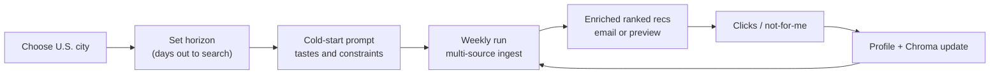

# SceneScout: Product Redesign (2026-07-05)

This document records a **scope and purpose change** for SceneScout. It complements
[`project_plan.md`](project_plan.md) (build order) and [`architecture.md`](architecture.md)
(system design). It does not replace them.

**Supersedes (for product direction only):** the indie/creative-community ingest focus
documented in interim UAT feed work ([`260629_uat_debug_plan.md`](260629_uat_debug_plan.md)
UAT-D.8/D.11). That UAT plan is **complete**; its pipeline fixes remain valid.

---

## Why the change

SceneScout is a **learning project in agentic AI** — multi-agent orchestration,
personalization, enrichment, and feedback loops — not a product competing with
StubHub or Ticketmaster on inventory breadth.

The prior direction optimized for **independent creative listings** (readings, gallery
openings, free weekly roundups) via RSS and fragile HTML scrapes. That produced:

- High scrape maintenance and ingest noise
- Extraction LLM cost on entries that normalization later discarded
- Weak signal for testing **personalization** (the core agent story)

The new direction optimizes for **mainstream events in a user-chosen U.S. city**,
personalized through cold-start prompt and behavioral feedback over time.

---

## Product purpose (after redesign)

SceneScout helps a single user discover **mainstream events they would actually attend**
(concerts, comedy, sports, theater, festivals) in their city, ranked to their taste.

Success is measured by:

1. A working multi-agent pipeline end-to-end
2. **Personalized recommendations** that change as the user interacts (clicks, negative feedback)
3. Efficient use of LLM tokens (judgment where needed, not on every raw row)

Success is **not** measured by catalog completeness or covering every niche listing site.

---

## User journey

1. **City** — which metro's feed catalog to use
2. **Horizon** — how many days ahead to include (e.g. 7, 14, 30)
3. **Cold-start prompt** — genres, artists, budget, neighborhoods, dislikes
4. **Pipeline run** — ingest → normalize → enrich → rank → curate → email
5. **Feedback** — weak/strong signals update `UserProfile` and Chroma liked-events

---

## Design principles

| Principle | Implication |
|---|---|
| **Keep all agents** | Feed Scout through Evaluation stay; Neighborhood Scout remains valuable for hyper-local context even at mainstream venues |
| **Multiple sources per city** | A metro may use several mainstream APIs plus one structured aggregator (e.g. DoNYC); dedup handles overlap |
| **Minimize scrape and token burn** | Prefer `api` and `ical` adapters; retire editorial RSS and fragile indie scrapes unless explicitly needed for a demo |
| **Structured ingest lane** | When adapters return high-confidence title, venue, datetime, and URL, skip Event Extraction LLM (see [Phase 1C](project_plan.md)) |
| **Personalization is the demo** | Phase 8 feedback loop and ranking are higher priority than adding marginal feeds |
| **City-scoped ingest** | Do not fetch feeds for cities the user is not in |

---

## Source strategy

### Keep / add (mainstream)

- **DoNYC** (or similar structured aggregator) — venue + ISO datetime on listing cards
- **Multiple event APIs per metro** — e.g. Ticketmaster, SeatGeek, Songkick (implement incrementally; see Phase 1B.3)
- **Venue ICS** where endpoints are stable and not rate-limited

### Deprioritize / remove

- Editorial RSS (neighborhood news, lifestyle blogs)
- Fragile indie scrapes (Brooklyn Rail, Harlem One Stop, etc.)
- **Eventbrite search** — public `/v3/events/search/` returns 404; inactive until a supported endpoint exists (org-owned events or partner API)

### Unchanged from UAT work

- LibCal library feeds remain **retired** (class-series noise)
- `seen_entries` cache, ETag 304, deduplication, normalization window logic — all stay; horizon becomes user-configurable in Phase 1C

---

## What we are not building

- Ticketing, checkout, or inventory management
- Nationwide coverage at launch (one metro done well is enough)
- StubHub-style completeness or price comparison as primary value

---

## Relationship to other docs

| Document | Role after redesign |
|---|---|
| [`architecture.md`](architecture.md) | Updated overview, onboarding fields, structured ingest lane |
| [`project_plan.md`](project_plan.md) | **Phase 1C** — implementation subphases |
| [`260629_uat_debug_plan.md`](260629_uat_debug_plan.md) | **Completed** incident playbook; historical UAT-D items |
| [`README.md`](../README.md) | Entry point (optional one-paragraph pointer to this doc) |

---

## Personalization acceptance demo

Use this to verify the redesign goal (manual or integration test):

1. **Run A** — cold-start prompt emphasizing live music; note top recommendations
2. **Simulate clicks** on 2–3 music events (feedback + Chroma)
3. **Run B** — same city and horizon; expect higher music weighting in top 10
4. **Negative signal** — "not for me" on a category; expect downward shift next run

Tier B/C UAT should target **non-zero `normalized_events` and `curated_recommendations`**
with mainstream feeds and user horizon aligned — not `--max-extraction` caps that hide
most of the catalog.

---

## Cursor build pointer

Implementation work lives in [Phase 1C — Personalized Mainstream Discovery](project_plan.md).
Branch one subphase at a time: `feat/1c-1-profile-city-horizon`, etc.
