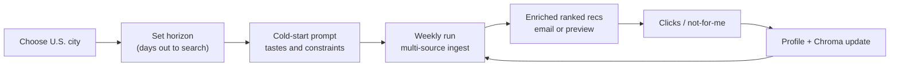

# SceneScout: Product Redesign (2026-07-05)

This document records a **scope and purpose change** for SceneScout. It complements
[`project_plan.md`](project_plan.md) (build order) and [`architecture.md`](architecture.md)
(system design). It does not replace them.

**Supersedes (for product direction only):** the indie/creative-community ingest focus
documented in interim UAT feed work ([`260629_uat_debug_plan.md`](260629_uat_debug_plan.md)
UAT-D.8/D.11). That UAT plan is **complete**; its pipeline fixes remain valid.

**Phase 1C (Jul 2026):** Personalized mainstream discovery — `UserProfile.home_city` /
`horizon_days`, city-scoped feeds, structured ingest bypass, user horizon windows,
Ticketmaster national API (`1C.7`), structured category inference on scrape/API bypass rows.
See [Phase 1C](project_plan.md) for subphase checklist.

---

## Why the change

SceneScout is a **learning project in agentic AI** — multi-agent orchestration,
personalization, enrichment, and feedback loops — not a product competing with
StubHub or Ticketmaster on inventory breadth.

The prior direction optimized for **independent creative listings** (readings, gallery
openings, free weekly roundups) via RSS and fragile HTML scrapes. That produced:

- High scrape maintenance and ingest noise
- Extraction LLM cost on entries that normalization later discarded
- Weak signal for testing **personalization** (the core agent story)

The new direction optimizes for **mainstream events in a user-chosen U.S. city**,
personalized through cold-start prompt and behavioral feedback over time.

---

## Product purpose (after redesign)

SceneScout helps a single user discover **mainstream events they would actually attend**
(concerts, comedy, sports, theater, festivals) in their city, ranked to their taste.

Success is measured by:

1. A working multi-agent pipeline end-to-end
2. **Personalized recommendations** that change as the user interacts (clicks, negative feedback)
3. Efficient use of LLM tokens (judgment where needed, not on every raw row)

Success is **not** measured by catalog completeness or covering every niche listing site.

---

## User journey



1. **City** — which metro's feed catalog to use
2. **Horizon** — how many days ahead to include (e.g. 7, 14, 30)
3. **Cold-start prompt** — genres, artists, budget, neighborhoods, dislikes
4. **Pipeline run** — ingest → normalize → enrich → rank → curate → email
5. **Feedback** — weak/strong signals update `UserProfile` and Chroma liked-events

---

## Design principles

| Principle | Implication |
|---|---|
| **Keep all agents** | Feed Scout through Evaluation stay; Neighborhood Scout remains valuable for hyper-local context even at mainstream venues |
| **Multiple sources per city** | A metro may use several mainstream APIs plus one structured aggregator (e.g. DoNYC); dedup handles overlap |
| **Minimize scrape and token burn** | Prefer `api` and `ical` adapters; retire editorial RSS and fragile indie scrapes unless explicitly needed for a demo |
| **Structured ingest lane** | When adapters return high-confidence title, venue, datetime, and URL, skip Event Extraction LLM (see [Phase 1C](project_plan.md)) |
| **Personalization is the demo** | Phase 8 feedback loop and ranking are higher priority than adding marginal feeds |
| **City-scoped ingest** | Do not fetch feeds for cities the user is not in |

---

## Source strategy

### Keep / add (mainstream)

- **DoNYC** (or similar structured aggregator) — venue + ISO datetime on listing cards
- **Ticketmaster Discovery API** — national feed (`is_national: true`); geo-scoped via
  `profile.home_city`; requires `TICKETMASTER_API_KEY` (Phase 1C.7)
- **Multiple event APIs per metro** — e.g. SeatGeek, Songkick (implement incrementally; see Phase 1B.3)
- **Venue ICS** where endpoints are stable and not rate-limited

### Deprioritize / remove

- Editorial RSS (neighborhood news, lifestyle blogs)
- Fragile indie scrapes (Brooklyn Rail, Harlem One Stop, etc.)
- **Eventbrite search** — public `/v3/events/search/` returns 404; inactive until a supported endpoint exists (org-owned events or partner API)

### Unchanged from UAT work

- LibCal library feeds remain **retired** (class-series noise)
- `seen_entries` cache, ETag 304, deduplication, normalization window logic — all stay; horizon becomes user-configurable in Phase 1C

---

## What we are not building

- Ticketing, checkout, or inventory management
- Nationwide coverage at launch (one metro done well is enough)
- StubHub-style completeness or price comparison as primary value

---

## Relationship to other docs

| Document | Role after redesign |
|---|---|
| [`architecture.md`](architecture.md) | Updated overview, onboarding fields, structured ingest lane |
| [`project_plan.md`](project_plan.md) | **Phase 1C** — implementation subphases |
| [`260629_uat_debug_plan.md`](260629_uat_debug_plan.md) | **Completed** incident playbook; historical UAT-D items |
| [`README.md`](../README.md) | Entry point (optional one-paragraph pointer to this doc) |

---

## Personalization acceptance demo

Use this to verify the redesign goal. Requires `LLM_API_KEY` in `.env`. Full Tier C
walkthrough also in [`README.md`](../README.md#tiered-uat).

### Prerequisites

```bash
uv sync --all-extras
cp .env.example .env   # set LLM_API_KEY
export UAT_HOME_CITY="New York"
export UAT_HORIZON_DAYS=14
```

Optional clean slate (cold-start profile + fresh extraction):

```bash
rm -f vol-profiles/profile.json
rm -f vol-cache/cache.db
```

**Mainstream feed subset** (structured DoNYC + Ticketmaster + RSS the skint):

```bash
FEEDS=donyc,theskint,ticketmaster
```

Set `TICKETMASTER_API_KEY` in `.env` for Ticketmaster rows. Omit `ticketmaster` from
`FEEDS` to run without the national API.

Do **not** use `--max-extraction` for this demo — it caps cache-miss rows sent to the
extraction LLM and can hide catalog gaps. Reserve `--max-extraction N` for Tier B cost
caps when debugging extraction only (see [Tier B warning](#tier-b--c-uat-examples) below).

### Run A — cold start (live music)

```bash
uv run python -m scene_scout.cli uat \
  --prompt "Live music, indie rock, and jazz clubs in NYC. No stand-up comedy." \
  --dry-run \
  --city "New York" \
  --horizon-days 14 \
  --feeds "$FEEDS"
```

**Pass criteria:** `output/uat_{run_id}/summary.json` shows `normalized_events` > 0,
`curated_recommendations` > 0 (when ranking completes), and `top_recommendations` lean
toward music. DoNYC rows should increment `structured_ingest_bypass_count` on first run
(cache cold).

Inspect:

```bash
cat output/uat_*/summary.json | jq '{normalized_events, curated_recommendations, structured_ingest_bypass_count, top_recommendations}'
```

### Between runs — simulate warm personalization

**Phase 8** (`apply_feedback_signals`) is not wired yet. Until then, use one of:

1. **Profile weight bump (recommended):** After Run A, edit `vol-profiles/profile.json`
   and raise weights for categories you clicked (e.g. `"Music": 0.95`). The orchestrator
   loads this file on Run B and reuses `home_city` / `horizon_days` from it.
2. **Chroma liked events (optional):** If you captured enriched event IDs from logs,
   call `scene_scout.services.chroma.add_liked_event()` to seed semantic similarity.
3. **Negative signal (manual):** Add categories to `stated_dislikes` in the profile JSON
   and re-run; ranking excludes those categories immediately.

### Run B — same city and horizon, updated taste

```bash
uv run python -m scene_scout.cli uat \
  --prompt "Same preferences as Run A" \
  --dry-run \
  --feeds "$FEEDS"
```

(`--city` / `--horizon-days` come from the persisted profile when present.)

**Pass criteria:** Music-tagged events rank higher in `top_recommendations` vs Run A after
the profile weight bump; excluded categories drop out when added to `stated_dislikes`.

### Cold-start contrast (no profile edit)

Delete `vol-profiles/profile.json` between runs and compare two prompts (e.g. music vs
comedy) with the same `--city`, `--horizon-days`, and `--feeds`. Demonstrates User
Preference parsing even before the Phase 8 feedback loop.

---

## Tier B / C UAT examples

Align **city**, **horizon**, and **feeds** on every tier. Default mainstream NYC:

| Setting | Value |
|---|---|
| `--city` / `UAT_HOME_CITY` | `New York` |
| `--horizon-days` / `UAT_HORIZON_DAYS` | `14` (or 7–30) |
| `--feeds` | `donyc,theskint,ticketmaster` |

**Tier A — ingest only (~seconds, no LLM):**

```bash
uv run python -m scene_scout.cli feed-probe --city "New York"
```

Expect non-zero raw entries from DoNYC + the skint (+ other active NYC feeds if not
filtered).

**Tier B — pipeline smoke with optional cost cap:**

Use `--stop-after normalize` for a cheap end-to-end check through normalization without
enrichment LLM cost. Add `--max-extraction N` **only** when testing extraction cost caps —
it sends at most N cache-miss rows to the extraction LLM and will under-report catalog
size.

```bash
uv run python -m scene_scout.cli uat \
  --prompt "Live music and free NYC events this week" \
  --dry-run \
  --city "New York" \
  --horizon-days 14 \
  --feeds donyc,theskint,ticketmaster \
  --stop-after normalize
```

**Tier C — full integration (dry-run, no Resend):**

```bash
uv run python -m scene_scout.cli uat \
  --prompt "Live music, comedy, and free NYC events in the next two weeks" \
  --dry-run \
  --city "New York" \
  --horizon-days 14 \
  --feeds donyc,theskint,ticketmaster
```

**Pass criteria:** `summary.json` → `normalized_events` > 0 with mainstream feeds and user
horizon aligned. Target `curated_recommendations` > 0 when enrichment and ranking complete.
With Ticketmaster enabled, expect **more normalized/enriched events** than
`donyc,theskint` alone (API rows bypass extraction and carry categories).

Verified Jul 2026 (Tier B, `--stop-after normalize`): 25 DoNYC rows → 5 normalized events
with `--city "New York"`, `--horizon-days 14`, `--feeds donyc,theskint`. Phase 1C.7 adds
Ticketmaster for catalog depth.

**Tier D:** Same as Tier C without `--dry-run`; requires Resend + `USER_EMAIL` (release
gate).

---

## Phase 1C.7 — Mainstream catalog depth

**Goal:** Increase UAT catalog size and make structured-ingest personalization meaningful.

| Deliverable | Detail |
|---|---|
| **Ticketmaster adapter** | `event_api.py` + `ticketmaster` slot in `feeds.yaml` (`is_national: true`, `active: true`) |
| **Structured categories** | Keyword inference on DoNYC/scrape bypass rows when adapters omit category labels |
| **Env** | `TICKETMASTER_API_KEY` in `.env` (see `.env.example`) |
| **UAT default feeds** | `donyc,theskint,ticketmaster` |

**Pass criteria:** `feed-probe --city "New York"` shows Ticketmaster entries when keyed;
UAT with the three-feed default yields materially more normalized/enriched events than
`donyc,theskint` alone.

---

## Cursor build pointer

Implementation work lives in [Phase 1C — Personalized Mainstream Discovery](project_plan.md).
Branch one subphase at a time: `feat/1c-1-profile-city-horizon`, etc.
