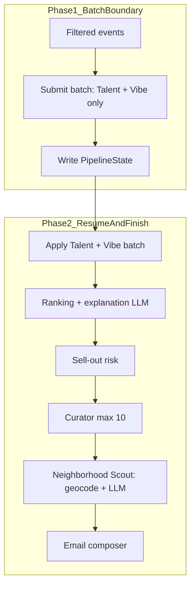

# SceneScout: Deferred Neighborhood Enrichment Plan

**Status:** Implemented (Subphases A–E complete).

This supplemental plan documents a refactoring to limit **Nominatim/Overpass geocoding**
and **Neighborhood Scout LLM** calls to venues that appear in the final curated
recommendation list (~10 events), instead of every event that passes the pre-enrichment
filter. It complements — but does not replace — the main
[project plan](project_plan.md) and [architecture](architecture.md).

**Related project plan sections:**
- [Phase 5 — Enrichment Pipeline](project_plan.md) (Talent Scout, Vibe Classifier, Neighborhood Scout, batch orchestration)
- [Phase 5.8 — Deferred Neighborhood Enrichment](project_plan.md) (pointer to this doc)

**Related architecture sections:**
- [Scheduled Pipeline](architecture.md) — two-phase execution and batch boundary
- [Neighborhood Scout: Hyper-Local Architecture](architecture.md) — Mode A/B, cache TTLs

**Branching:** One feature branch per subphase (e.g. `feat/deferred-neighborhood-a-split-batch`), same convention as Phase 1B.

---

## Goal

Reduce external geocoding and neighborhood LLM cost per pipeline run without changing
ranking scores or email quality for final picks. Talent and vibe enrichment remain on
the full filtered set so ranking (`vibe_fit`, `performer_affinity`, diversity) stays
accurate.

---

## Problem

Today, geocoding and neighborhood narration happen **before ranking**, on every event
that passes the pre-enrichment filter.

Current flow (from [architecture.md](architecture.md)):

```
Phase 1 — Ingest and normalize:
  …
  → Geocode venues (Nominatim, cached)
  → Submit enrichment batch (Talent Scout + Vibe + Neighborhood Scout)
  → Write PipelineState to vol-pipeline-state
  → Poll every 5 minutes

Phase 2 — Enrich, rank, and send:
  → Apply batch results → EnrichedEvent[]
  → Ranking → Sell-Out Risk → Curator → Email Composer → Send
```

The orchestrator implements this in
[`_collect_enrichment_batch_requests()`](../scene_scout/orchestrator.py): for each
filtered event it calls `prepare_neighborhood_job()` (Nominatim + Overpass) and adds a
Neighborhood Scout batch item.

| Signal | Today | After refactor |
|---|---|---|
| Geocode attempts (cold cache) | Up to N filtered events | ≤ M curated picks (M ≤ 10) |
| Neighborhood LLM calls (cold cache) | Up to N filtered events | ≤ unique venues among picks (often ≤ 5) |
| Talent + vibe batch size | N filtered (minus cache hits) | Unchanged |

Example: 80 filtered events → up to 80 geocode + 80 neighborhood LLM calls today, even
though the curator keeps at most
[`CURATOR_MAX_RECOMMENDATIONS`](../scene_scout/curator_config.py) (10).

### Safe to defer

Ranking uses normalized `event.neighborhood` for `location` scoring in
[`ranking.py`](../scene_scout/agents/ranking.py) — **not** `neighborhood_context`.

### Must stay pre-ranking

- **Talent Scout** — `top_performer_affinity` in score breakdown
- **Vibe Classifier** — `vibe_fit` and diversity/novelty signals

### Consumers of deferred fields

- Email body ([`email_composer.py`](../scene_scout/agents/email_composer.py))
- Recommendation history ([`history.py`](../scene_scout/services/history.py))
- Optional field in ranking-explanation prompt ([`ranking_explanation.txt`](../scene_scout/prompts/ranking_explanation.txt)) — acceptable to leave empty pre-ranking

### Out of scope

Ranking explanation LLM still runs on all eligible filtered events in
[`ranking.run()`](../scene_scout/agents/ranking.py). Deferring that is a separate
future optimization.

---

## Target architecture



**Expected savings (uncached):** ~70 geocode/Overpass calls and ~70 neighborhood LLM
calls replaced by ≤10 (often ≤5 unique venues due to `CURATOR_MAX_PER_VENUE = 2`).
`venue_cache` hits still skip external calls entirely.

---

## Subphase A — Split enrichment batch

**Files:** [`scene_scout/orchestrator.py`](../scene_scout/orchestrator.py)

1. **Remove neighborhood from Phase 1 batch collection**
   - In `_collect_enrichment_batch_requests()`, delete the block that calls
     `prepare_neighborhood_job()` and appends `neighborhood_scout` batch requests
     (lines ~720–739).
   - Return `list[BatchRequest]` only (drop `neighborhood_jobs` tuple).

2. **Remove neighborhood from Phase 2 batch apply**
   - In `_apply_enrichment_batch()`, stop calling `neighborhood_scout.run()`.
   - Apply only `talent_scout.run()` then `vibe_classifier.run()`.
   - Enriched events leave Phase 2 with empty `neighborhood_context` /
     `venue_coordinates` (defaults from [`EnrichedEvent`](../scene_scout/models/enrichment.py)).

3. **Simplify `PipelineState`**
   - Remove `neighborhood_jobs` field and `_serialize/_deserialize_neighborhood_job`
     helpers.

**Done when:** Phase 1 batch contains only `talent_scout` and `vibe_classifier`
requests.

---

## Subphase B — Post-curator neighborhood helper

**Files:** [`scene_scout/agents/neighborhood_scout.py`](../scene_scout/agents/neighborhood_scout.py)

Add `enrich_curated_neighborhoods(recommendations, *, cache, run_id) -> list[CuratedRecommendation]`:

1. **Venue deduplication:** Group by `venue_cache_key(venue, city)`. At most one
   `prepare_neighborhood_job()` per unique venue.
2. **Run existing agent:** Call `neighborhood_scout.run()` on the deduped representative
   `EnrichedEvent` list (≤10 items — inline submit/poll via existing `run()` is fine; no
   second batch boundary or `PipelineState` write).
3. **Map results back:** For each `CuratedRecommendation`, copy `neighborhood_context`,
   `neighborhood_confidence`, and `venue_coordinates` onto:
   - top-level `recommendation.neighborhood_context`
   - nested `recommendation.event` via `model_copy(update={...})`
4. **Structured logging:** Emit `neighborhood_geocode_calls`, `neighborhood_llm_calls`,
   and `neighborhood_cache_hits` counters (surfaces in Dev tab run logs).

**Done when:** Two recommendations at the same venue share one geocode/LLM result; cache-hit
venues produce zero external calls.

---

## Subphase C — Wire orchestrator

**Files:** [`scene_scout/orchestrator.py`](../scene_scout/orchestrator.py)

Insert post-curator neighborhood step in `_run_pipeline()` between curator and email:

```python
curated = await neighborhood_scout.enrich_curated_neighborhoods(
    curator_result.recommendations,
    cache=cache,
    run_id=run_id,
)
```

Pass `curated` (not raw `curator_result.recommendations`) to `email_composer.run()`.

**Done when:** Email preview and history records include `neighborhood_context` for
final picks when confidence ≥ threshold.

---

## Subphase D — Tests

**Files:**
- [`tests/test_orchestrator.py`](../tests/test_orchestrator.py) — assert
  `_collect_enrichment_batch_requests` never includes `neighborhood_scout`; assert
  post-curator hook is invoked; mock geocode to verify call count bounded by curated size.
- [`tests/agents/test_neighborhood_scout.py`](../tests/agents/test_neighborhood_scout.py) —
  unit tests for `enrich_curated_neighborhoods` (venue dedupe, cache hit, failure →
  `None` context).
- [`tests/integration/test_feedback_loop.py`](../tests/integration/test_feedback_loop.py) —
  end-to-end neighborhood on curated picks only.

**Key assertion:**

```python
mock_geocode.assert_awaited_count <= len(curated_recommendations)
# equals unique venue count when cache is cold
```

**Done when:** CI passes; regression test proves geocode is **not** called during
`_collect_enrichment_batch_requests`.

---

## Subphase E — Docs and observability

**Files:**
- [`docs/architecture.md`](architecture.md) — update Scheduled Pipeline diagram (remove
  geocode from Phase 1; add post-curator neighborhood step).
- [`docs/diagrams/diagrams.md`](diagrams/diagrams.md) — update enrichment batch node if
  present.
- [`docs/project_plan.md`](project_plan.md) — revise done-when notes for 5.5 and 5.6 to
  reference deferred execution (neighborhood runs post-curator, not in Phase 1 batch).

**Done when:** Architecture doc matches runtime order; operators can see reduced geocode
volume in structured logs.

---

## Migration and rollout

| Risk | Mitigation |
|---|---|
| In-flight runs with old `PipelineState.neighborhood_jobs` | One-time clear of `vol-pipeline-state` |
| Email missing neighborhood on first deploy mid-run | Acceptable; only affects resumed runs |
| Ranking explanations lack `neighborhood_context` | Optional in prompt; still uses normalized `event.neighborhood` |

**Suggested rollout order:** B (helper) → A (split batch) → C (wire) → D (tests) → E
(docs). Alternatively: B+A+C in one PR, then D+E.

---

## Success criteria

- Cold-cache run with N filtered events and M curated recommendations (M ≤ 10): **at most
  M** Nominatim geocode attempts and **at most M** neighborhood LLM calls (≤ unique
  venues).
- Talent and vibe batch size unchanged (still N_filtered minus cache hits).
- Weekly email and history records include `neighborhood_context` for final picks when
  confidence ≥ threshold.
- No change to ranking scores (location component still uses normalized neighborhood
  string).
