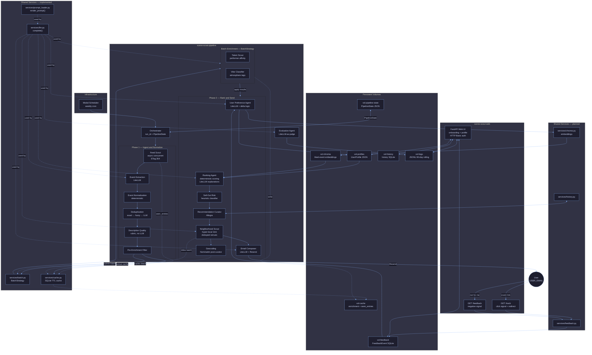

# SceneScout Diagrams

Open this file in Cursor and press **Cmd+Shift+V** (Mac) or **Ctrl+Shift+V** (Windows/Linux)
to preview both diagrams.

Source files (edit these first, then sync the fenced blocks below):

- [system_architecture.mmd](./system_architecture.mmd)
- [data_flow.mmd](./data_flow.mmd)

---

## System Architecture

---

## Data Flow

```mermaid
%%{init: {'theme': 'base', 'themeVariables': {'primaryColor': '#1e1e2e', 'primaryTextColor': '#cdd6f4', 'primaryBorderColor': '#89b4fa', 'lineColor': '#89b4fa', 'secondaryColor': '#181825', 'tertiaryColor': '#313244'}}}%%
flowchart TD
    RSS["RSS Feeds\nFeedConfig list"]

    RSS --> A1["1. Feed Scout\nout: RawFeedEntry list\n     FeedHealthReport list"]

    A1 -->|"seen_entries hit → skip extraction"| CACHE_SEEN["seen_entries cache\nNormalizedEvent by feed_id + entry_hash"]
    CACHE_SEEN --> A3B["reuse NormalizedEvent\nbypass extraction + normalization"]

    A1 -->|"cache miss"| A2["2. Event Extraction\nin:  RawFeedEntry list\nout: EventCandidate list\n  title, venue, date, city\n  is_event bool\n  extraction_confidence float"]

    A2 -->|"valid events"| A3["3. Event Normalization\nout: NormalizedEvent list\n  id SHA-256 hash\n  start_datetime\n  price_cents optional\n  is_free bool"]

    A2 -->|"is_event=False"| DISCARD_EXT["discarded at extraction"]

    A3 --> A4
    A3B --> A4["4. Deduplication\nout: NormalizedEvent list deduped\n  exact → fuzzy → embedding → LLM\n  merge_log"]

    A4 --> A5["5. Description Quality\nout: NormalizedEvent list\n  description_quality_score float\n  low_information bool"]

    A5 --> FILTER["Pre-Enrichment Filter\nenrichment candidates only"]

    FILTER -->|"low_information discard\noutside week discard\n2-week window discard"| DISCARD["discarded events"]

    FILTER -->|"Talent + Vibe only\ncache miss → batch"| BATCH["BatchStrategy\nAnthropicBatch or ConcurrentAsync\nsingle submission per run"]

    BATCH --> A6["EnrichedEvent\n  performers PerformerInfo list\n  top_performer_affinity float\n  vibe_tags 2-5 strings\n  neighborhood fields empty pre-rank"]

    PROF["UserProfile\n  name, email\n  category_weights map\n  vibe_preferences list\n  excluded_categories list"] --> A7

    CHROMA["Chroma Index vol-chroma\nliked-event embeddings"] --> A7

    A6 --> A7["6. Ranking Agent\nout: RankedEvent list\n  score float\n  score_breakdown:\n    category_fit, vibe_fit\n    semantic_similarity\n    performer_affinity, location\n    novelty, source_quality\n    description_quality\n  explanation string LLM grounded\n  wildcard_slot bool"]

    A7 --> A8["7. Sell-Out Risk\nout: RankedEvent list\n  sellout_risk low medium high"]

    HIST["Recommendation History vol-history\nrecency penalties applied"] --> A9

    A8 --> A9["8. Recommendation Curator Allegra\nout: CuratedRecommendation max 10\n  rank int\n  explanation string intact\n  sellout_urgency_note optional\n  feedback_token UUID\n  is_wildcard bool"]

    A9 --> NS["9. Neighborhood Scout\ngeocode + LLM on curated picks\n  dedupe by venue\n  neighborhood_context optional"]

    NS --> A10["10. Email Composer\nout: HTML email via Resend\n  tracking links per recommendation\n    /track token click redirect\n    /feedback token negative signal\n  UAT subject prefix with run_id"]

    A10 --> EMAIL["User Email USER_EMAIL Modal Secret"]

    EMAIL -->|"click event link"| SIG1["FeedbackEvent click\n  token, event_id, categories\n  score_breakdown, rank, run_id"]

    EMAIL -->|"not for me"| SIG2["FeedbackEvent negative"]

    SIG1 --> FBSTORE["vol-feedback SQLite"]
    SIG2 --> FBSTORE

    FBSTORE --> UPA["User Preference Agent\n  decay-weighted delta e^-lambda t\n  half-life 30 days\n  category_weights updated\n  vibe_preferences updated\n  Chroma index updated on clicks"]

    UPA --> PROF
    UPA --> CHROMA

    A10 --> EVAL["11. Evaluation Agent\nout: quality report\n  overall_quality float\n  flagged_recommendations\n  list_level_issues"]
```

