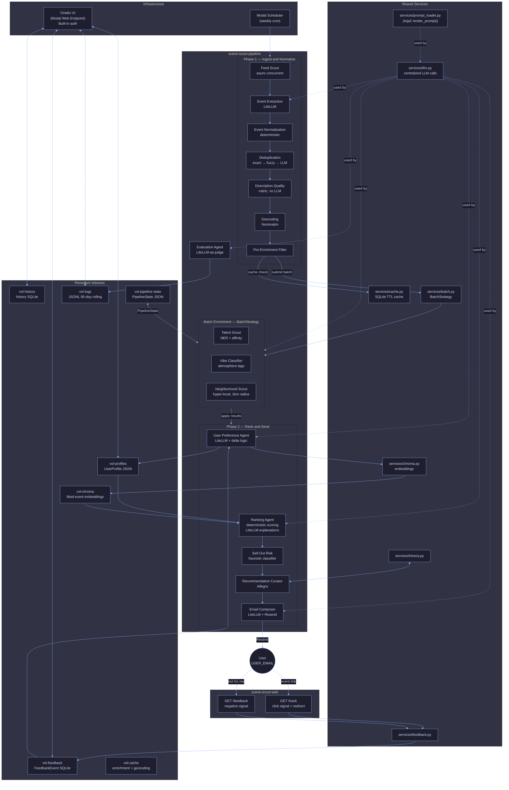

# SceneScout Diagrams

Open this file in Cursor and press `Cmd+Shift+V` to render both diagrams.

---

## System Architecture

```mermaid
%%{init: {'theme': 'base', 'themeVariables': {'primaryColor': '#1e1e2e', 'primaryTextColor': '#cdd6f4', 'primaryBorderColor': '#89b4fa', 'lineColor': '#89b4fa', 'secondaryColor': '#181825', 'tertiaryColor': '#313244'}}}%%
flowchart TD
    subgraph INFRA["Infrastructure"]
        MODAL["Modal Scheduler\n(weekly cron)"]
        GRADIO["Gradio UI\n(Modal Web Endpoint)\nBuilt-in auth"]
    end

    subgraph PIPELINE["scene-scout-pipeline"]
        subgraph PHASE1["Phase 1 — Ingest and Normalize"]
            FS["Feed Scout\nasync concurrent"]
            EX["Event Extraction\nLiteLLM"]
            NO["Event Normalization\ndeterministic"]
            DD["Deduplication\nexact → fuzzy → LLM"]
            DQ["Description Quality\nrubric, no LLM"]
            GEO["Geocoding\nNominatim"]
            FI["Pre-Enrichment Filter"]
        end

        subgraph BATCH["Batch Enrichment — BatchStrategy"]
            TS["Talent Scout\nNER + affinity"]
            VC["Vibe Classifier\natmosphere tags"]
            NS["Neighborhood Scout\nhyper-local, 1km radius"]
        end

        subgraph PHASE2["Phase 2 — Rank and Send"]
            UP["User Preference Agent\nLiteLLM + delta logic"]
            RK["Ranking Agent\ndeterministic scoring\nLiteLLM explanations"]
            SO["Sell-Out Risk\nheuristic classifier"]
            CU["Recommendation Curator\nAllegra"]
            EC["Email Composer\nLiteLLM + Resend"]
        end

        EV["Evaluation Agent\nLiteLLM-as-judge"]
    end

    subgraph WEB["scene-scout-web"]
        TR["GET /track\nclick signal + redirect"]
        FB["GET /feedback\nnegative signal"]
    end

    subgraph SERVICES["Shared Services"]
        LLM["services/llm.py\ncentralized LLM calls"]
        PL["services/prompt_loader.py\nJinja2 render_prompt()"]
        BS["services/batch.py\nBatchStrategy"]
        CS["services/cache.py\nSQLite TTL cache"]
        CH["services/chroma.py\nembeddings"]
        FBS["services/feedback.py"]
        HS["services/history.py"]
    end

    subgraph VOLUMES["Persistent Volumes"]
        VP["vol-profiles\nUserProfile JSON"]
        VC2["vol-chroma\nliked-event embeddings"]
        VFB["vol-feedback\nFeedbackEvent SQLite"]
        VH["vol-history\nhistory SQLite"]
        VCA["vol-cache\nenrichment + geocoding"]
        VPS["vol-pipeline-state\nPipelineState JSON"]
        VL["vol-logs\nJSONL 90-day rolling"]
    end

    MODAL --> PHASE1
    FS --> EX --> NO --> DD --> DQ --> GEO --> FI
    FI -->|"cache check"| CS
    FI -->|"submit batch"| BS
    BS --> BATCH
    VPS <-->|"PipelineState"| BATCH
    BATCH -->|"apply results"| PHASE2
    VP --> RK
    VC2 --> RK
    RK --> SO --> CU
    HS <--> CU
    CU --> EC
    EC -->|"Resend"| USER(("User\nUSER_EMAIL"))

    USER -->|"event link"| TR
    USER -->|"not for me"| FB
    TR --> FBS --> VFB
    FB --> FBS
    VFB --> UP
    UP --> VP
    UP --> CH --> VC2

    GRADIO <--> VP
    GRADIO <--> VFB
    GRADIO <--> VH
    GRADIO <--> VL
    EV --> VL

    LLM -.->|"used by"| EX
    LLM -.->|"used by"| BATCH
    LLM -.->|"used by"| RK
    LLM -.->|"used by"| EC
    LLM -.->|"used by"| UP
    LLM -.->|"used by"| EV
    PL -.->|"used by"| LLM
```

---

## Data Flow

```mermaid
%%{init: {'theme': 'base', 'themeVariables': {'primaryColor': '#1e1e2e', 'primaryTextColor': '#cdd6f4', 'primaryBorderColor': '#89b4fa', 'lineColor': '#89b4fa', 'secondaryColor': '#181825', 'tertiaryColor': '#313244'}}}%%
flowchart TD
    RSS["RSS Feeds\nlist[FeedConfig]"]

    RSS --> A1["1. Feed Scout\nout: list[RawFeedEntry]\n     list[FeedHealthReport]"]

    A1 --> A2["2. Event Extraction\nin:  list[RawFeedEntry]\nout: list[EventCandidate]\n  title, venue, date, city\n  is_event: bool\n  extraction_confidence: float"]

    A2 -->|"is_event=False → discard"| A3["3. Event Normalization\nout: list[NormalizedEvent]\n  id: SHA-256 hash\n  start_datetime: datetime\n  price_cents: Optional[int]\n  is_free: bool"]

    A3 --> A4["4. Deduplication\nout: list[NormalizedEvent]\n  exact → fuzzy → embedding → LLM\n  + merge_log"]

    A4 --> A5["5. Description Quality\nout: list[NormalizedEvent]\n  description_quality_score: float\n  low_information: bool"]

    A5 --> GEO["Nominatim Geocoding\nout: venue_coordinates: tuple[float,float]\n  poi_list within 1km"]

    GEO -->|"low_information=True → discard\noutside week → discard\n2-week window → discard"| FILTER["Pre-Enrichment Filter\nenrichment candidates only"]

    FILTER -->|"cache hit → skip LLM\ncache miss → batch"| BATCH["BatchStrategy\nAnthropicBatch or ConcurrentAsync\nsingle submission per run"]

    BATCH --> A6["EnrichedEvent\n  performers: list[PerformerInfo]\n    name, entity_type, genre_tags\n    confidence, affinity_score\n  top_performer_affinity: float\n  vibe_tags: list[str] (2-5 tags)\n  neighborhood_context: Optional[str]\n  neighborhood_confidence: float\n  venue_coordinates: Optional[tuple]"]

    PROF["UserProfile\n  name, email\n  category_weights: dict\n  vibe_preferences: list\n  excluded_categories: list"] --> A7

    CHROMA["Chroma Index\nvol-chroma\nliked-event embeddings"] --> A7

    A6 --> A7["6. Ranking Agent\nout: list[RankedEvent]\n  score: float\n  score_breakdown:\n    category_fit\n    vibe_fit\n    semantic_similarity\n    performer_affinity\n    location\n    novelty\n    source_quality\n    description_quality\n  explanation: str (LLM, grounded)\n  wildcard_slot: bool"]

    A7 --> A8["7. Sell-Out Risk\nout: list[RankedEvent]\n  sellout_risk: low|medium|high\n  (heuristic classifier)"]

    HIST["Recommendation History\nvol-history\nrecency penalties applied"] --> A9

    A8 --> A9["8. Recommendation Curator — Allegra\nout: list[CuratedRecommendation] ≤10\n  rank: int\n  explanation: str (intact)\n  neighborhood_context: Optional[str]\n  sellout_urgency_note: Optional[str]\n  feedback_token: UUID\n  is_wildcard: bool"]

    A9 --> A10["9. Email Composer\nout: HTML email via Resend\n  tracking links per recommendation:\n    /track?token=X&signal=click&redirect=...\n    /feedback?token=X&signal=negative\n  subject: [UAT {run_id}] in UAT mode"]

    A10 --> EMAIL["User Email\nUSER_EMAIL Modal Secret"]

    EMAIL -->|"click event link"| SIG1["FeedbackEvent\n  signal: click\n  token, event_id, categories\n  score_breakdown, rank, run_id"]

    EMAIL -->|"not for me"| SIG2["FeedbackEvent\n  signal: negative"]

    SIG1 --> FBSTORE["vol-feedback SQLite"]
    SIG2 --> FBSTORE

    FBSTORE --> UPA["User Preference Agent\n  decay-weighted delta:\n    e^(-λt), half-life 30 days\n  category_weights updated\n  vibe_preferences updated\n  Chroma index updated (clicks)"]

    UPA --> PROF
    UPA --> CHROMA

    A10 --> EVAL["10. Evaluation Agent\nout: quality report\n  overall_quality: float\n  flagged_recommendations\n  list_level_issues"]
```
